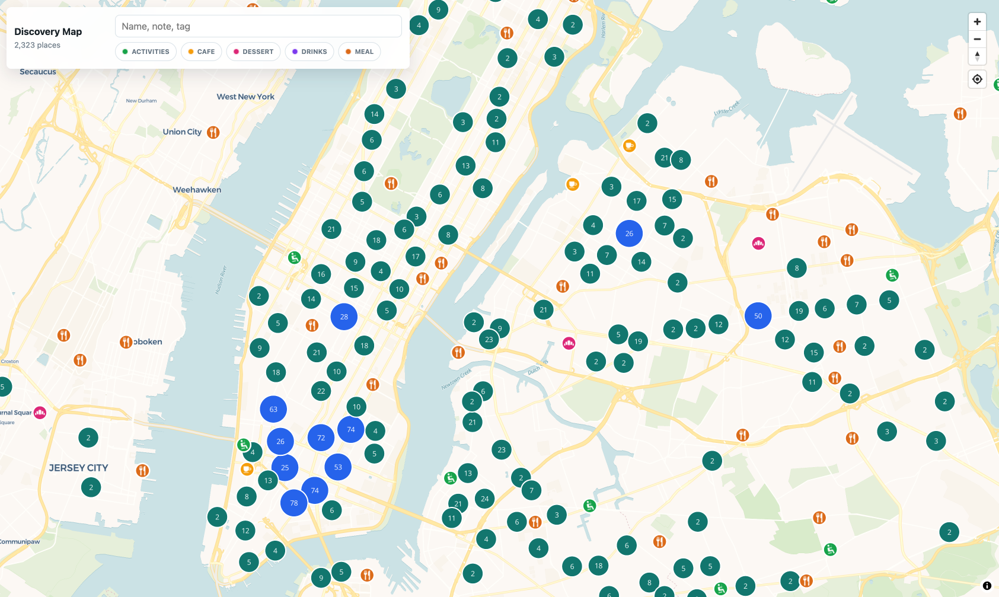

# Discovery Map

An interactive map of 2,300+ curated places — restaurants, cafés, bakeries, bars, parks — built with MapLibre GL and served as a static site from GitHub Pages. The data is a public projection of a private personal dataset; the app itself is generic, so you can point it at your own places.

**🗺️ Live: https://geofftang.github.io/discovery-map/**



## Features

- Thousands of places rendered as clustered **GL layers** (not DOM markers) — stays smooth fully zoomed out.
- Category filter, with a distinct color + icon per category.
- Search your places **and anywhere** — a free OpenStreetMap geocoder finds places not on the map yet and flies you there.
- Detail panel with your notes/tags + one-click **Open in Google Maps**.
- Locate-me button.

## How it works

The app reads a single file — `docs/discovery.geojson` — and renders it. That file is a **public projection of a private dataset**: a build step copies only public-safe fields out of a personal vault CSV (see [the design note](#design-note-the-publicprivate-split) for why a leak can't slip through).

```
private vault CSV  ──►  build-discovery-geojson.py  ──►  docs/discovery.geojson  ──►  MapLibre app
  (source of truth)      (public-egress projection)        (the only data the app reads)
```

## Why this stack

- **MapLibre GL** (over Leaflet) — renders thousands of points as GL cluster *layers*, not per-pin DOM nodes; Leaflet's DOM markers lagged badly at this scale. Swap cost: low — thin map boundary; Google Maps JS is the documented fallback.
- **MapLibre** (over Mapbox GL) — same API, open-source fork, **no access token, no billing account**.
- **Static GeoJSON + GitHub Pages** (no backend) — clustering runs client-side; deploys free on every push.
- **Photon / OpenStreetMap geocoder** (over Google Places) — free, no API key, powers the "search anywhere" box.

## Run it locally

```bash
npm install
npm run dev      # http://127.0.0.1:5173 — no API keys, no credentials
```

Clone-and-run works immediately: the committed `docs/discovery.geojson` is real sample data.

## Make it your own map

The app is generic — only the data is mine.

1. Replace `docs/discovery.geojson` with your places (schema below).
2. Adjust the category colors/icons in `src/main.js` (`CATEGORY_COLORS`, `CATEGORY_ICONS`) to match your categories.
3. Push to `main` — the included workflow (`.github/workflows/pages.yml`) builds and deploys to Pages. Set the repo's **Pages source to "GitHub Actions"** once.

### Data contract

Each pin is a GeoJSON `Feature`; geometry is `[longitude, latitude]`. Properties:

| property | required | drives |
|---|---|---|
| `name` | yes | label + search |
| `category` | yes | pin color + icon (must match a key in `CATEGORY_COLORS`) |
| `signal` | no | shown in the detail panel (your priority / quality marker) |
| `description` | no | detail-panel text + search |
| `secondary_tags` | no | detail-panel pills + search (`;`-separated) |
| `city` | no | improves the Open-in-Google-Maps handoff |
| `google_place_id` | no | exact-listing Open-in-Google-Maps handoff |

### Rebuild from a private source (maintainer)

```bash
python3 scripts/build-discovery-geojson.py \
  --input /path/to/master-discovery.csv \
  --output docs/discovery.geojson
```

## Tests

The load-bearing test guards the egress boundary — the security property below:

```bash
python3 scripts/test_build_discovery_geojson.py
```

It asserts (1) features carry **only** allowlisted properties, (2) private columns never appear in the output, (3) `google_place_id` is status-gated, and (4) the leak scan fails the build on a planted vault link, local path, or email.

## Design note: the public/private split

The builder constructs each public record **field-by-field from a positive allowlist** (`PUBLIC_FIELDS`); it never takes the private row and strips sensitive fields out. The distinction is load-bearing: a denylist fails *open* the day a new sensitive column is added to the source, while an allowlist fails *closed* — a new column is excluded by construction. Two backstops reinforce it:

- **Fail-closed egress scan** — the build aborts if any forbidden pattern (vault deep-link, local path, email) appears anywhere in the output, including inside an allowed free-text field.
- **Unknown-column alert** — an unclassified source column is flagged so it gets a deliberate public/private decision instead of silent inclusion.

The unattended publisher runs an independent copy of the scan before every push.

## Out of scope

Editing places from the map, accounts, routing/itineraries, and live opening-hours — the map is a fast read-only view; curation happens in the source dataset. Live Google details would need a separate cache/cost design and are deliberately deferred.

## License

MIT — see [LICENSE](LICENSE).

## Two builds, one app (owner and public)

Since 2026-09 the collection is a tree of per-place Markdown records (one file per place, YAML
frontmatter, `## Why` / `## Evidence` / `## Visits` / `## Log` sections) kept in a private repo.
`scripts/build_places_index.py` parses that tree, joins a regenerable provider-signals cache
(`signals/`, gitignored, authoritative for nothing), and emits:

| artifact | what | where it goes |
|---|---|---|
| `index.db` | SQLite + FTS5 + coordinate index | derived, gitignored, seconds to rebuild |
| `private/private.json` | full payload: status, hidden, lists, evidence, visits, provider advisories | owner build only (`npm run build:private` → `dist-private/`, served locally) |
| `public.json` | constructed field-by-field from [`public-allowlist.yml`](public-allowlist.yml) | the public feed, once the cutover lands |

Deploy-blocking assertions: every facet value in the controlled vocab, every `merged_into` target
exists, ids unique; for the public build the emitted field set is diffed against the allowlist, a
private-field canary must be absent, and the egress scan must be clean. The builder refuses to
write the private payload anywhere under `docs/`. Tests: `npm test`.

The owner build shows closed and hidden pins only when asked, and renders a provider's closure
claim as an advisory next to the owner's own status rather than hiding the pin — a Google
"permanently closed" has been wrong every time it was checked.
